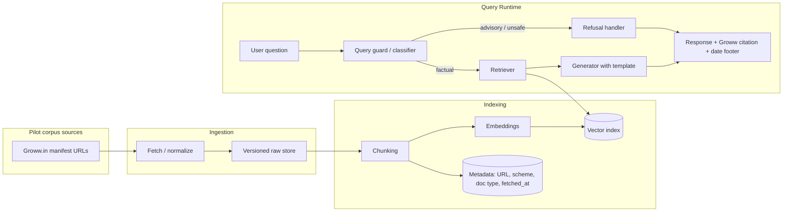
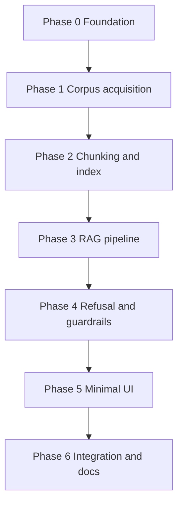

# Mutual Fund FAQ Assistant — Phase-Wise Architecture

This document describes a detailed, phase-wise system architecture for the **facts-only Mutual Fund FAQ Assistant** defined in the project problem statement. It is organized so each phase has clear inputs, outputs, components, and quality gates before the next phase begins.

**Per-phase edge cases:** [edge-cases/phase-0-edge-cases.md](edge-cases/phase-0-edge-cases.md) · [phase-1](edge-cases/phase-1-edge-cases.md) · [phase-2](edge-cases/phase-2-edge-cases.md) · [phase-3](edge-cases/phase-3-edge-cases.md) · [phase-4](edge-cases/phase-4-edge-cases.md) · [phase-5](edge-cases/phase-5-edge-cases.md) · [phase-6](edge-cases/phase-6-edge-cases.md)

---

## 1. Architectural Principles (Cross-Cutting)

| Principle | Implication for design |
|-----------|------------------------|
| Facts-only | Retrieval corpus follows the Phase 0 manifest (pilot: Groww pages); generation is constrained by prompts and post-checks; advisory patterns trigger refusal. |
| Single source citation | Retriever returns one primary chunk or document; the user-visible **citation URL** must be a **Groww** URL per the pilot allowlist (see **1.1**). |
| No PII | No auth, no contact forms, no session storage of identifiers; logs must redact or omit sensitive patterns. **PII-guard outcomes do not attach any URLs** in the user-visible response (see **1.1**). |
| URL discipline (unknown / unsupported) | When the assistant **does not have a supported answer** from the pilot corpus, it **must not attach any URL**—no Groww “citation”, and no AMFI/SEBI educational links—so users are not steered toward pages that could solicit personal data in contexts we avoid (see **1.1**). |
| Transparency | Every **successful factual** answer: ≤3 sentences, **one** Groww citation link, footer `Last updated from sources: <date>`. |
| Accuracy over “intelligence” | Prefer quoting or tightly paraphrasing retrieved text; avoid extrapolation beyond chunks. |

**High-level pattern:** Lightweight **RAG** — ingest manifest URLs → chunk and index → retrieve top-k → LLM composes a constrained answer (or refusal path) → optional lightweight validation → UI.

### 1.1 Pilot citation policy (this repository)

- **Factual answers:** The single citation link must be **exactly one** of the five **Groww** scheme URLs listed in **3.1.1** (the URL for the scheme the answer is about). No AMC, AMFI, SEBI, or other domains as citations for successful Q&A in this pilot.
- **Unsupported factual answers (“we don’t know”)** — e.g. retrieval cannot support a reliable answer, or the question is outside the pilot corpus: the response **must not include any URL** (no Groww citation and **no** AMFI/SEBI educational links). The copy must not invite the user to “see the link below.”
- **PII-related guard outcomes** (PAN/Aadhaar/account/OTP/contact prompts, etc.): same rule — **no URLs** in the user-visible response, to avoid implying endorsement or steering users toward data-collection flows in those sensitive contexts.
- **Other refusals** (advisory, performance-in-prose, etc.): the pilot may still include **at most one** AMFI/SEBI **educational** pointer where the Phase 0 refusal template explicitly provides it (these are not factual fund “citations”).
- **Grounding checks** must reject any model output whose citation URL is not on the pilot allowlist.

---

## 2. Reference Logical Architecture (End State)

---

## 3. Phase 0 — Foundation, Compliance, and Scope Lock

**Goal:** Freeze scope, AMC, schemes, and compliance rules so later phases do not drift.

### 3.1 Activities

- Select **one AMC** and **3–5 schemes** with **category diversity** (e.g., large-cap, flexi-cap, ELSS). **For this repository, scope is locked to HDFC Mutual Fund and five schemes** with category spread (large-cap, mid-cap, focused, diversified equity, ELSS); see **3.1.1** for the canonical Groww scheme URLs used as seed manifest entries.
- Build a **URL manifest** with columns: `url`, `document_type`, `scheme_id` (if applicable), `priority`, `allowed_use`. **Pilot:** the **minimum** manifest is the five Groww scheme URLs in **3.1.1** (ingestion + retrieval + **citations** all align to these pages). To approach the broader problem statement’s 15–25 URL corpus size, add **additional `https://groww.in/...` pages only** (e.g. MF help or static content on the same product); **citations for factual answers remain limited to the five scheme URLs** unless you explicitly extend the citation allowlist in Phase 0.
- Define **query taxonomy**: in-scope factual intents (expense ratio, exit load, min SIP, ELSS lock-in, riskometer, benchmark, statement/CG download process) vs out-of-scope (advice, “which is better”, return predictions). **Implemented:** [`config/phase0/query_taxonomy.json`](../config/phase0/query_taxonomy.json).
- Define **refusal copy** and **default educational links** (AMFI/SEBI) for refusals. **Implemented:** [`config/phase0/refusal_and_education.json`](../config/phase0/refusal_and_education.json).
- Define **“last updated”** semantics: e.g., max `fetched_at` among chunks used in the answer, or document-level date from source if available. **Implemented:** [`config/phase0/LAST_UPDATED_SEMANTICS.md`](../config/phase0/LAST_UPDATED_SEMANTICS.md).

#### 3.1.1 Project lock — AMC, schemes, and seed URLs (Groww)

| Scheme | Role in diversity set | `document_type` (manifest) | URL |
|--------|-------------------------|----------------------------|-----|
| HDFC Mid-Cap Fund — Direct — Growth | Mid-cap | Groww scheme page | https://groww.in/mutual-funds/hdfc-mid-cap-fund-direct-growth |
| HDFC Equity Fund — Direct — Growth | Broad / diversified equity | Groww scheme page | https://groww.in/mutual-funds/hdfc-equity-fund-direct-growth |
| HDFC Focused Fund — Direct — Growth | Focused | Groww scheme page | https://groww.in/mutual-funds/hdfc-focused-fund-direct-growth |
| HDFC TaxSaver (ELSS) — Direct — Growth | ELSS | Groww scheme page | https://groww.in/mutual-funds/hdfc-elss-tax-saver-fund-direct-plan-growth |
| HDFC Large Cap Fund — Direct — Growth | Large-cap | Groww scheme page | https://groww.in/mutual-funds/hdfc-large-cap-fund-direct-growth |

Use these rows as the **fixed scheme set** for UI examples, metadata filters (`scheme`), and ingestion jobs. **Pilot citation rule:** for any successful factual reply, the **single** source link shown to the user must be the **Groww scheme URL** for that fund from this table (not HDFC AMC, AMFI, or SEBI), in line with **1.1**.

### 3.2 Deliverables

- Signed-off URL list and scheme list (**implemented:** [`config/phase0/manifest.json`](../config/phase0/manifest.json), [`config/phase0/schemes.json`](../config/phase0/schemes.json), [`config/phase0/citation_allowlist.json`](../config/phase0/citation_allowlist.json)).
- Content policy checklist (no third-party blogs; **pilot:** Groww URLs are the allowed citation surface per **1.1**; no performance comparisons in prose) (**implemented:** [`config/phase0/CONTENT_POLICY.md`](../config/phase0/CONTENT_POLICY.md)).
- Logging policy: no PAN/Aadhaar/account/OTP/email/phone collection or storage (**implemented:** [`config/phase0/LOGGING_POLICY.md`](../config/phase0/LOGGING_POLICY.md)).

### 3.3 Phase gate

- Stakeholder review of URL manifest and refusal policy before any ingestion at scale.

---

## 4. Phase 1 — Corpus Acquisition and Raw Artifact Management

**Goal:** Reliably download and version documents referenced in the manifest (pilot: Groww URLs, optionally extended with other pages on `groww.in` per Phase 0).

### 4.1 Subphases (implement sequentially)

Implement each subphase to completion before starting the next; later subphases depend on earlier artifacts and contracts.

| ID | Subphase | Objective | Primary output |
|----|-----------|-----------|----------------|
| **P1-S1** | Manifest binding | Load Phase 0 manifest; filter rows with `included_in_crawl: true`; validate URL shape (HTTPS, `groww.in` host per pilot); assign a deterministic **run id** / manifest version stamp. | Crawl plan: ordered URL list + run metadata. |
| **P1-S2** | HTTP fetch layer | Issue GETs with timeouts, retry/backoff on transient failures, stable `User-Agent`; capture status code and select response headers (`Last-Modified`, `ETag` where present); respect `robots.txt` policy as configured. | In-memory or streaming response per URL + fetch metadata. |
| **P1-S3** | Raw artifact store | Persist **immutable** raw bytes per fetch under `data/phase1/raw/` (or agreed path); key by content hash and/or `(run_id, canonical_url)`; never overwrite in place—new fetch → new blob. | Versioned raw blobs + sidecar fetch metadata. |
| **P1-S4** | HTML normalization | Read **P1-S3** artifacts (`fetch_*.body.html` + `.meta.json` under `data/phase1/raw/{run_id}/`); parse server-returned HTML to plain text; preserve lightweight structure hints (title, main headings) where extractable. Expect **JS-heavy Groww pages**: initial HTML may contain little visible copy (shell / payload placeholders)—treat low text yield as a first-class signal (`needs_manual_review` or P1-S5), not as “missing manifest data.” Attach `source_url` / `canonical_url`, `document_type`, `scheme_id`, **`fetched_at_utc`** from sidecar (and optional `Last-Modified` / `ETag` when present). | Normalized text + parsing metadata per URL (input to P1-S6 / Phase 2). |
| **P1-S5** | Low-content / JS-heavy fallback (optional) | Detect very low text yield after P1-S4; if product allows, optionally run a headless render path **only** for allowlisted URLs—otherwise flag `needs_manual_review` without substituting off-manifest sources. | Augmented normalizer output or explicit flags in run report. |
| **P1-S6** | Manifest runner & Phase 2 handoff | Orchestrate P1-S1→S4 (and S5 if enabled) over the crawl plan; emit a **run report** (per-URL success, HTTP code, hash, errors); write **normalized document bundles** (e.g. JSON/JSONL) consumable by Phase 2. | Run log + handoff files in `data/phase1/` (see repo `data/README.md`). |

**Exit criteria for Phase 1 (full phase):** still governed by **§4.5**; each subphase should have its own quick checks (e.g. S3: blobs readable and hashed; S6: every successful URL has a handoff record).

### 4.2 Components

| Component | Responsibility |
|-----------|----------------|
| **Fetcher** | HTTP(S) GET with retries, respect `robots.txt` where applicable, stable user-agent, timeouts. |
| **Normalizer** | Convert HTML/PDF to text or structured extracts; preserve page/section hints where possible. |
| **Raw artifact store** | Immutable blobs keyed by `(url, content_hash, fetched_at)` or similar; enables audit and re-ingestion. |
| **Manifest runner** | Scheduled or manual job to refresh corpus; records success/failure per URL. |

### 4.3 Data flow

1. Read URL manifest → fetch → store raw bytes + headers (e.g., `Last-Modified`, `ETag` if present). **In this repo:** crawl plan at `data/phase1/crawl_plans/crawl_plan__{run_id}.json` (P1-S1); raw response bytes at `data/phase1/raw/{run_id}/fetch_{NNNNN}_{slug}.body.{html|…}` with sidecar `fetch_{NNNNN}_{slug}.meta.json` (P1-S2/S3); aggregate `data/phase1/runs/{run_id}/fetch_report.json`.
2. Parse → extract text (PDF/HTML pipeline); attach metadata: `source_url`, `document_type`, `scheme`, `fetched_at`. **Pilot reality:** corpus is **HTML from `groww.in` only** (no PDF in the current manifest); timestamps for “last updated” should come from **`fetched_at_utc`** in `.meta.json` unless a reliable on-page date is later extracted.

### 4.4 Non-functional requirements

These requirements are tightened to match **what the pilot ingestion pipeline actually produces** (Groww HTML on disk, run-scoped directories, JSON sidecars).

- **Reproducibility (auditable snapshots):**
  - Bind each ingest run to **`manifest_id` + `manifest_version`** (Phase 0) and the deterministic **`run_id` / `plan_fingerprint_sha256`** from the crawl plan (P1-S1).
  - Treat **`content_sha256`** (in each `.meta.json`) as the content-address of stored bytes; **`fetcher_version`** (or equivalent) in metadata documents which fetch implementation produced the blob.
  - A new crawl **must not overwrite** prior raw files in the same `run_id` directory (immutable store); a new snapshot → new `run_id` folder (or new ordinal namespace), so “same URL, different day” remains comparable via reports.
- **Failure handling (no silent drift off manifest):**
  - Failed URLs (HTTP ≥400, robots disallow, TLS/DNS failures, final host ≠ `groww.in`) are recorded in **`fetch_report.json`** with per-entry status; **do not** substitute URLs outside the Phase 0 manifest / citation policy.
  - Partial corpus (some URLs failing) is acceptable only with **documented failures** and Phase gate judgment (§4.5)—not by backfilling from non-`groww.in` sources.
- **Payload shape (Groww HTML reality):**
  - Stored bodies are **HTML** (`.body.html` for typical responses); fund facts may live in **inline JSON / script payloads** or post-hydration DOM—P1-S4 and Phase 2 chunking should be designed for **noisy or sparse first-pass text**, with explicit low-yield flags feeding P1-S5 / review.
  - **Size cap:** large responses may be **truncated** at fetch time; `.meta.json` carries **`truncated: true`** when applicable—downstream must not assume full-page HTML.
- **TLS and robots (operational, not product “truth”):**
  - Some developer machines fail **default TLS verification** against `groww.in`; the ingestion CLI may support a **dev-only** unverified TLS path—this is **not** a production baseline; runbooks should require proper CA trust in deployed environments.
  - **`robots.txt`** may be unavailable or unparsed in edge cases; current tooling can still proceed with the attempt logged in metadata—**tighten** to fail-closed if your compliance bar requires strict robots success before any GET.
- **Clocks:** use **UTC** for `fetched_at_utc` and report timestamps to avoid skew across workers (aligns with `LAST_UPDATED_SEMANTICS` in Phase 0 config).

### 4.5 Phase gate

- ≥90% (or agreed threshold) of manifest URLs successfully ingested for the pilot schemes, with documented failures. **Evidence in this repo:** per-run `data/phase1/runs/{run_id}/fetch_report.json` (`summary.ok` vs `summary.failed` vs crawl-plan `url_count`).

---

## 5. Phase 2 — Chunking, Enrichment, and Index Build

**Goal:** Create retrieval units that map cleanly to **one primary citation** per answer.

### 5.1 Chunking strategy

Chunking applies to **normalized text** produced after **P1-S4** (not to raw `fetch_*.body.html` blobs). For the **current pilot corpus**, inputs are **Groww `text/html`** pages (scheme detail + hub/help); there are **no PDFs** in the manifest today—keep PDF/page-aware splitting as a **future** path when manifest rows add PDFs.

- **Size:** Overlap chunks (e.g., 400–800 **tokens** with overlap) remains a reasonable default **after boilerplate removal** (scripts, nav, repeated chrome). Raw HTML is often huge while **signal text is small**; tune targets using measured token counts on **normalized** output, not on raw file size. If P1-S4 yields very short text (JS shell), prefer **smaller windows / fewer splits** or defer chunking until P1-S5 / richer extraction—avoid empty or near-empty chunks.
- **Boundaries:** Prefer paragraph / heading / list boundaries **when the DOM still carries semantic structure**. App-style pages may lack meaningful headings; fall back to sentence or fixed windows, and carry **`section_title` / `block_type`** only when reliable.
- **Structured payloads:** When fund facts appear inside **inline JSON or `__NEXT_DATA__`-style script blocks** (common on modern MF sites), chunk the **extracted key-value text** (or compact JSON snippets) rather than splitting raw `<script>` tags across chunks.
- **Truncation:** If `.meta.json` has **`truncated: true`**, chunk only what was stored; document in chunk metadata that the source was partial.
- **Metadata per chunk:** `chunk_id`, **`canonical_url` or `source_url`** (Groww page), **`scheme_id`** (from crawl row / sidecar when present), `doc_type`, **`fetched_at_utc`** (from P1-S3 meta, for footer alignment), optional `section_title`, `language`, optional `run_id` / `content_sha256` for lineage.

### 5.2 Index

| Layer | Purpose |
|-------|---------|
| **Vector index** | Semantic similarity for user questions. |
| **Metadata filters** (optional) | Restrict retrieval by `scheme` if detected in query; improves precision. |

### 5.3 Embedding model

| Item | Pilot value |
|------|-------------|
| **Model** | [`BAAI/bge-small-en-v1.5`](https://huggingface.co/BAAI/bge-small-en-v1.5) (BGE small, English) |
| **Library** | [`sentence-transformers`](https://www.sbert.net/) (`SentenceTransformer.encode`) |
| **Vector dimension** | **384** (recorded in each index `manifest.json` as `vector_dim`) |
| **Similarity** | **Cosine** via **L2-normalized** embeddings + **FAISS `IndexFlatIP`** (inner product on unit vectors) |
| **Config** | Default in [`config/phase2/defaults.json`](../config/phase2/defaults.json); override at build time with `scripts/run_phase2_build_index.py --model <id>` |
| **Index manifest** | Each bundle under `data/phase2/index/{run_id}/manifest.json` stores `embedding_model`, chunking params, and `built_at_utc` for audit |

**Build-time behavior:** Phase 2 loads the model once, chunks normalized P1 text (see §5.1), embeds all chunk texts in batches, and writes `index.faiss` plus `chunk_metadata.json` / `chunks.jsonl`. The same model id must be used at query time (Phase 3 loads it from the bundle manifest — see §6.1).

**Refresh policy:** Re-embed when normalized corpus text changes (new crawl `run_id` or `chunk_fingerprint_sha256` change in manifest). Do not mix embeddings from different models in one FAISS index.

**Optional:** Set **`HF_TOKEN`** when building in CI so Hugging Face Hub downloads are faster and rate limits are higher (see §9.5).

### 5.4 Phase gate

- Spot-check: for a fixed set of golden questions, retrieved top-5 contains the correct passage from the **Groww (pilot) corpus** for ≥ agreed accuracy.

---

## 6. Phase 3 — Retrieval and Grounded Generation Pipeline

**Goal:** Produce **short, factual, source-backed** answers using RAG.

### 6.1 Retrieval

- **Input:** User query (and optional scheme hint from UI).
- **Process:** Load the Phase 2 bundle’s **`embedding_model`** from `manifest.json` (pilot: **`BAAI/bge-small-en-v1.5`**) → embed the query with the same `SentenceTransformer` settings (**normalized** vectors) → **FAISS** inner-product search (top-k, e.g., k=12 in `config/phase3/defaults.json`) → optional scheme filters, URL dedupe, and anchor merges (see Phase 3 implementation).
- **Output:** Ordered list of chunks with scores + metadata (must include `source_url`, `fetched_at`).

### 6.2 Citation selection

- **Primary citation rule:** Select **one** chunk (e.g., highest score above threshold, or first passing a “contains answer span” heuristic). The emitted **citation URL** must be the **Groww scheme URL** for the answered scheme (**1.1**), even if the chunk text was assembled from multiple on-page sections.
- If multiple schemes are mixed in results, **disambiguation**: ask user to pick scheme (minimal UI) or refuse with clarification — avoids wrong attribution.

### 6.3 Generator (LLM)

- **Provider (pilot implementation):** **Groq** — Chat Completions via the OpenAI-compatible endpoint (`https://api.groq.com/openai/v1`), using the `openai` Python SDK with `GROQ_API_KEY` (see Phase 3 `defaults.json` for `llm_model` / `llm_base_url`). Extractive fallback when the key is unset.
- **System prompt:** Facts-only; no advice; no comparisons; for performance-related questions, point to the **Groww scheme page** for that fund (pilot citation policy), without fabricating returns.
- **User prompt:** Include only retrieved chunk text (and metadata), the user question, and a rigid output schema:
  - Answer: max 3 sentences.
  - Citation: exactly one URL from the **pilot Groww allowlist** (**1.1**, **3.1.1**), matching the scheme answered.
  - Footer line: `Last updated from sources: <ISO date from metadata>`.
- **Temperature:** Low for determinism.

### 6.4 Grounding checks (lightweight)

- **URL allowlist:** Citation URL is **exactly** one of the five Groww scheme URLs and matches the scheme for the answer.
- **Sentence count:** ≤3.
- **Forbidden patterns:** “you should”, “better fund”, “I recommend” → regenerate once or fall back to refusal.

### 6.5 Phase gate

- Human eval on golden set: citation valid **and Groww-only per 1.1**, footer present, sentence limit respected, no advisory language.

---

## 7. Phase 4 — Refusal, Guardrails, and Edge Cases

**Goal:** Polite, consistent handling of advisory and non-factual queries without breaking trust.

### 7.1 Query guard (layered)

1. **Classifier or rule layer:** Detect advisory intents (“should I”, “which is better”, “best fund”, personalized portfolio questions).
2. **Out-of-corpus / unsupported:** If retrieval cannot support a reliable answer → respond with inability to find supported info **without attaching any URL** (see **1.1** “Unsupported factual answers”). Do **not** use AMC/SEBI/AMFI URLs as the **citation** for a factual fund answer in this pilot.
3. **Performance / returns:** Do not compute or compare returns; point to the **Groww scheme page** for that fund as the single citation when still giving a factual pointer; otherwise use the configured refusal path (may include an educational link **only** where **1.1** allows it for that refusal class).

### 7.2 Refusal response template

- Polite decline + restate facts-only scope. **Educational AMFI/SEBI links are omitted** for **unsupported factual** and **PII-guard** outcomes (**1.1**); other refusal classes may still include **at most one** educational link when provided by Phase 0 copy.
- No fake specificity; no implied ranking.

### 7.3 Phase gate

- Adversarial prompt set: system refuses or deflects appropriately without leaking advice.
- **Repo:** `config/phase4/adversarial_prompts.json` and `python scripts/run_phase4_adversarial.py` (requires Phase 2 index); guard implementation in `src/phase4/query_guard.py`.

---

## 8. Phase 5 — Minimal User Interface

**Goal:** Simple, compliant UX aligned with deliverables.

### 8.1 UI elements

- **Welcome message** explaining facts-only behavior.
- **Three example questions** (in-scope).
- **Visible disclaimer:** `Facts-only. No investment advice.`
- **Chat or Q&A panel:** Question input, answer area showing answer + link + last-updated footer.
- **No PII:** No login, no email/phone fields, no document upload of statements.

### 8.2 Optional enhancements (still minimal)

- Scheme selector dropdown (limited to the 3–5 chosen schemes) to improve retrieval precision.
- “Sources” expander is **not** required by spec if the single link is always visible in the answer.

### 8.3 Phase gate

- UX review against problem statement checklist (welcome, examples, disclaimer).

*Pilot implementation:* static UI in `src/phase5/public/`, bundled with the Phase 6 server at `/ui/` (same-origin `POST /query`); `GET /meta/schemes` and `GET /meta/disclaimer` supply the scheme list and disclaimer text from Phase 0 config.

---

## 9. Phase 6 — Integration, Observability, and Documentation

**Goal:** Operable pilot with README and known limitations.

### 9.1 API / app boundaries (suggested)

| Module | Exposed surface |
|--------|-----------------|
| Ingestion CLI / job | Build corpus from manifest. |
| Index builder | Rebuild vector index from processed chunks. |
| Query API | `POST /query` → structured JSON: `answer`, `citation_url`, `last_updated`, `refusal` flag. |
| Static UI | Calls query API or bundled server. |

*Pilot implementation:* `src/phase6/app.py` (FastAPI), `python scripts/run_phase6_server.py`; response body matches `Phase3Response.to_dict()` (includes `evidence`, `footer_line`, `generator_route`, etc.). `GET /health` exposes index manifest metadata for deploy checks (see edge case E6.2).

### 9.2 Observability (privacy-safe)

- Log: timestamp, query length, scheme id (if any), refusal vs answer, latency, retrieval scores.
- **Do not** log full user queries if policy requires minimization; at minimum avoid PII patterns in logs.

### 9.3 README contents (mapping to deliverables)

- Setup instructions (env, keys if any, how to run ingestion and app).
- Selected AMC and schemes.
- **Architecture overview** (RAG flow, diagram reference).
- **Known limitations:** corpus coverage (Groww-only pilot), HTML/JS rendering quirks on ingested pages, stale on-page data until next refresh, language scope; **citations are Groww-only** for factual answers (**1.1**).
- **Disclaimer snippet** verbatim for reuse in UI.

### 9.4 Phase gate

- End-to-end demo: example questions → correct citations; advisory questions → refusals; README reproduces setup on a clean machine.

### 9.5 Scheduled corpus refresh (GitHub Actions)

For **repeatable “latest data”** without a human shell, use **GitHub Actions** (or any CI scheduler) to re-run the **Phase 1 → Phase 2** pipeline on a **cron** and/or **`workflow_dispatch`** (manual run).

| Concern | Recommended approach |
|--------|-------------------------|
| **What to run** | **P1-S1** (crawl plan) → **P1-S2/S3** (fetch + raw store) → **P1-S4** (normalize) → **Phase 2** (chunk + embed + FAISS). Same order as [`README.md`](../README.md). Each successful run produces a new **`run_id`** under `data/phase1/` / `data/phase2/index/` so `fetched_at_utc` and “last updated” move forward honestly. |
| **Schedule** | Use `on.schedule` (e.g. **weekly**) unless the AMC / site policy explicitly allows higher frequency. Aggressive polling can violate **robots.txt**, strain origins, and trigger blocks. |
| **Secrets** | **`HF_TOKEN`** (optional): higher Hugging Face Hub rate limits when downloading **`BAAI/bge-small-en-v1.5`** in Phase 2. **`GROQ_API_KEY`**: Phase 3 grounded JSON generation via Groq (not required for ingest/index; extractive fallback if unset). Do **not** store PAN/Aadhaar or account identifiers in secrets or logs (Phase 0 logging policy). |
| **Where outputs go** | **Do not assume** large `data/` trees belong in git. Prefer **`actions/upload-artifact`**, a release asset, or **object storage** (S3, GCS, Azure Blob) keyed by `run_id` / commit / date. Keep **artifact retention** short unless compliance requires longer archival. |
| **Runtime** | Phase 2 (torch + `sentence-transformers` + FAISS) is **CPU-heavy** and may **download models** on cold runners; set a generous **`timeout-minutes`** and enable **pip / Hugging Face caching** between runs. |
| **Compliance** | Respect **robots.txt** and manifest allowlists in production; treat **`--skip-robots` / `--insecure-ssl`** as **dev-only** (see Phase 1 notes in this doc). If CI egress to `groww.in` is disallowed, run the job on an approved runner or substitute a manual refresh process. |
| **Implementation reference** | [`.github/workflows/corpus_refresh.yml`](../.github/workflows/corpus_refresh.yml) (daily cron + `workflow_dispatch`). **Scheduled runs** commit the pilot Phase 2 bundle to `main` so **Railway** redeploys from GitHub; see [deploy/HOSTING-RAILWAY-VERCEL.md](../deploy/HOSTING-RAILWAY-VERCEL.md) §3. CI artifacts remain optional backups. |

---

## 10. Phase Dependency Chart

*Note:* Phases 4 and 3 can be developed in parallel **after** Phase 2 has a draft index, but **production readiness** requires merging guardrails with the generator before UI hardening.

---

## 11. Success Criteria Traceability

| Success criterion (from problem statement) | Primary phases |
|---------------------------------------------|----------------|
| Accurate retrieval of factual information | 2, 3 |
| Strict facts-only responses | 0, 3, 4 |
| Valid source citations (Groww-only pilot) | 0 (**1.1**), 2, 3 |
| Proper refusal of advisory queries | 0, 4 |
| Clean, minimal UI | 5, 6 |

---

## 12. Risk Register (Architecture-Level)

| Risk | Mitigation |
|------|------------|
| PDF/HTML extraction errors | Human spot-check on golden docs; store raw files for re-parse. |
| Model hallucination beyond chunks | Strong prompting + single-source rule + post-checks; low temperature. |
| Stale data | Manifest refresh job; surface `last updated` honestly from fetch metadata. **Optional:** GitHub Actions scheduled pipeline (see **§9.5**). |
| Wrong scheme disambiguation | Scheme selector or explicit clarification question. |
| Compliance drift | Phase 0 policy doc; code review for new data sources. |
| Pilot uses Groww-only citations | Document clearly in README; downstream product may later require AMC/regulator links again. |

---

*Document generated to support implementation planning for the Mutual Fund FAQ Assistant (facts-only RAG). This pilot narrows **factual citation URLs** to Groww scheme pages (**1.1**); align implementation choices (frameworks, hosting, LLM provider) with organizational constraints not listed in the problem statement.*
